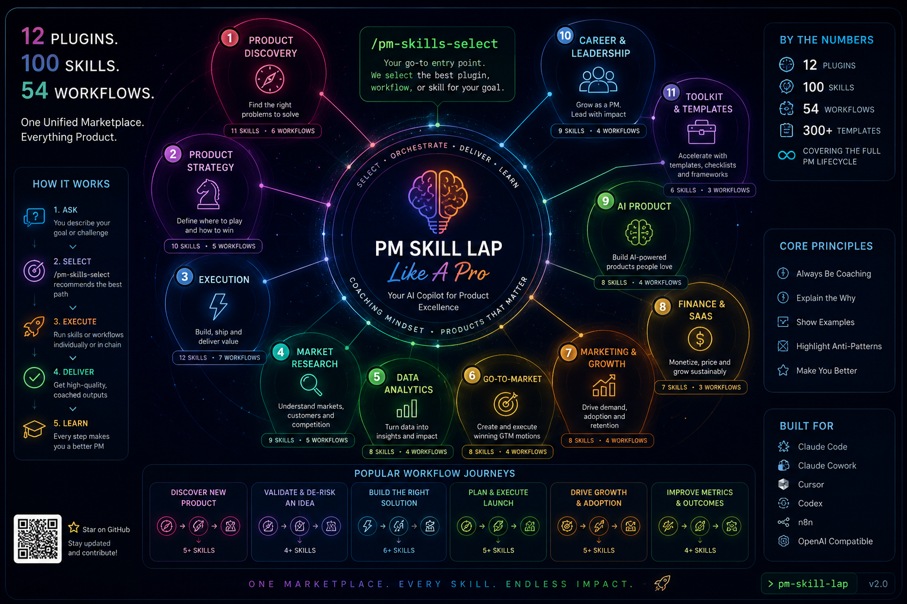

<a id="pm-skill-lap"></a>
# PM Skill LAP — PM Skills Like A Pro




> **The exhaustive PM skills marketplace for Claude Code and Claude Cowork.**  
> Built as a better-mix synthesis of `phuryn/pm-skills` and `deanpeters/Product-Manager-Skills`: marketplace architecture + pedagogic coaching + all major PM domains + one router to choose the right skill every time.


## Start here

Use the selector first:

```text
/pm-skills-select We need to decide if we should build an AI onboarding assistant for SMB customers.
```

`/pm-skills-select` acts like your PM chief of staff. It chooses the best plugin, skill, workflow, or chain, then explains why that path is better than the alternatives.

### Quick paths

| Situation | Start with |
|---|---|
| New idea, vague opportunity, early discovery | `/discover` |
| Strategic clarity, product direction, executive narrative | `/strategy` |
| PRD, requirements, buildable scope | `/write-prd` |
| Launch or GTM plan | `/plan-launch` |
| Roadmap, OKRs, prioritization | `/transform-roadmap`, `/plan-okrs`, `/pm-skills-select` |
| Metrics, cohorts, A/B tests, SQL | `/metrics-diagnostic`, `/analyze-cohorts`, `/analyze-test`, `/write-query` |
| AI product work | `/ai-readiness`, `/context-engineering`, `/recommendation-canvas` |
| SaaS economics or feature ROI | `/business-health`, `/feature-investment`, `/saas-metrics` |
| Career or leadership coaching | `/director-readiness`, `/vp-cpo-readiness`, `/product-sense-interview` |

---

## Why this repo exists

The first version was too thin. This rebuild is intentionally more exhaustive:

- It preserves the **plugin + command marketplace model** from phuryn.
- It applies the **Always Be Coaching / pedagogic-first standard** from Dean Peters.
- It includes every major skill area from both repos, consolidating overlaps instead of duplicating weakly.
- It makes `/pm-skills-select` the default entry point, so the user does not need to know the catalog.

---

## What LAP means by skill, workflow, and plugin

| Layer | Meaning | Example |
|---|---|---|
| **Skill** | A reusable PM capability or framework | `opportunity-solution-tree`, `pricing-strategy`, `create-prd` |
| **Workflow** | A slash command that chains skills | `/discover`, `/write-prd`, `/plan-launch` |
| **Plugin** | A domain package of related skills and workflows | `pm-product-discovery-lap`, `pm-finance-saas-lap` |
| **Selector** | The router that chooses the right path | `/pm-skills-select` |

---

## Marketplace overview

| Plugin | Domain | Skills | Workflows | Role |
| --- | --- | --- | --- | --- |
| `pm-skills-select` | PM Skills Select | 1 | 1 | The router, concierge, and orchestrator for the whole marketplace. |
| `pm-product-discovery-lap` | Product Discovery | 17 | 6 | From ambiguous idea to validated opportunity. |
| `pm-product-strategy-lap` | Product Strategy | 16 | 6 | Vision, positioning, models, choices, and strategic clarity. |
| `pm-execution-lap` | Execution & Delivery | 21 | 11 | Turn strategy into buildable, testable, shippable work. |
| `pm-market-research-lap` | Market Research | 7 | 5 | Understand users, markets, competitors, segments, and feedback. |
| `pm-data-analytics-lap` | Data Analytics | 5 | 4 | Use data to decide, diagnose, and learn. |
| `pm-go-to-market-lap` | Go-to-Market | 7 | 3 | Launch, sell, grow, and win with a clear motion. |
| `pm-marketing-growth-lap` | Marketing & Growth | 5 | 3 | Position, name, message, and compound growth. |
| `pm-finance-saas-lap` | Finance & SaaS Economics | 5 | 3 | Make product decisions through revenue, retention, and efficiency. |
| `pm-ai-product-lap` | AI Product Management | 3 | 3 | Build AI-shaped products with evidence, context, and proof-of-life testing. |
| `pm-career-leadership-lap` | Career & Leadership | 6 | 3 | Coach PMs from product sense to Director, VP, and CPO altitude. |
| `pm-toolkit-lap` | PM Toolkit | 7 | 6 | Practical PM utilities beyond core product work. |

---

## Install

### Claude Cowork

1. Open **Customize**.
2. Go to **Browse plugins** -> **Personal** -> **+**.
3. Choose **Add marketplace from GitHub**.
4. Enter your repo after publishing, for example:

```text
YOUR_GITHUB_USER/pm-skill-lap
```

### Claude Code

```bash
claude plugin marketplace add YOUR_GITHUB_USER/pm-skill-lap
claude plugin install pm-skills-select@pm-skill-lap
claude plugin install pm-product-discovery-lap@pm-skill-lap
claude plugin install pm-product-strategy-lap@pm-skill-lap
claude plugin install pm-execution-lap@pm-skill-lap
claude plugin install pm-market-research-lap@pm-skill-lap
claude plugin install pm-data-analytics-lap@pm-skill-lap
claude plugin install pm-go-to-market-lap@pm-skill-lap
claude plugin install pm-marketing-growth-lap@pm-skill-lap
claude plugin install pm-finance-saas-lap@pm-skill-lap
claude plugin install pm-ai-product-lap@pm-skill-lap
claude plugin install pm-career-leadership-lap@pm-skill-lap
claude plugin install pm-toolkit-lap@pm-skill-lap
```

### Exact local shortcut

This repo also includes `.claude/commands/pm-skills-select.md`, so local Claude setups can use:

```text
/pm-skills-select <your PM situation>
```

---

## Complete plugin catalog


<details>
<summary><strong>PM Skills Select</strong> — The router, concierge, and orchestrator for the whole marketplace. (1 skills, 1 workflows)</summary>

### Skills

| Skill | Purpose | Mix |
| --- | --- | --- |
| `pm-skills-select` | Diagnose a PM request and select the best plugin, skill, command, or chained workflow. It is the go-to entry point for the marketplace. | new |

### Workflows

| Command | Skill chain | When to use |
| --- | --- | --- |
| `/pm-skills-select` | `pm-skills-select` | Use this first whenever you are unsure where to start or want the best mix of skills. |

</details>

<details>
<summary><strong>Product Discovery</strong> — From ambiguous idea to validated opportunity. (17 skills, 6 workflows)</summary>

### Skills

| Skill | Purpose | Mix |
| --- | --- | --- |
| `brainstorm-ideas-existing` | Generate multi-perspective improvement ideas for an existing product using PM, design, engineering, data, and GTM lenses. | phuryn |
| `brainstorm-ideas-new` | Generate new-product concepts from a market, user problem, trend, or capability. | phuryn |
| `identify-assumptions-existing` | Surface risky assumptions across value, usability, viability, feasibility, data, and GTM for an existing product change. | phuryn |
| `identify-assumptions-new` | Surface risky assumptions for a zero-to-one idea across problem, customer, market, channel, strategy, team, feasibility, and economics. | phuryn |
| `prioritize-assumptions` | Rank assumptions by impact and uncertainty so the team tests what can kill the idea first. | phuryn |
| `experiment-design` | Design lean experiments, pretotypes, concierge tests, landing pages, fake doors, interviews, and data probes matched to the riskiest assumption. | phuryn, deanpeters |
| `opportunity-solution-tree` | Build an OST from outcome to opportunities, solutions, and experiments; keep solution bias visible. | phuryn, deanpeters |
| `interview-script` | Create a structured customer interview script with JTBD probes, non-leading questions, and learning goals. | phuryn, deanpeters |
| `summarize-interview` | Turn interview notes or transcript into JTBD, pains, gains, quotes, evidence strength, and next learning actions. | phuryn |
| `jobs-to-be-done` | Uncover jobs, triggers, struggling moments, desired outcomes, forces of progress, pains, and gains. | deanpeters, phuryn |
| `lean-ux-canvas` | Guide a team through Lean UX Canvas v2 to frame problems, assumptions, users, outcomes, and experiments. | deanpeters |
| `problem-framing-canvas` | Use structured problem-framing to clarify who has the problem, why it matters, what constraints exist, and what evidence is missing. | deanpeters |
| `problem-statement` | Write a user-centered problem statement with who, what, why, emotional context, and evidence. | deanpeters |
| `proto-persona` | Create proto-personas from research, team knowledge, market signals, and explicit assumptions. | deanpeters |
| `customer-journey-map` | Map stages, touchpoints, actions, emotions, pain points, opportunities, and metrics. | phuryn, deanpeters |
| `customer-journey-mapping-workshop` | Facilitate an interactive journey-mapping workshop with prompts, pacing, decisions, and outputs. | deanpeters |
| `discovery-process` | Run a complete discovery loop from problem hypothesis to evidence-backed next step. | deanpeters, phuryn |

### Workflows

| Command | Skill chain | When to use |
| --- | --- | --- |
| `/discover` | `problem-statement` -> `brainstorm-ideas-new` -> `identify-assumptions-new` -> `prioritize-assumptions` -> `experiment-design` | Start here for a new idea, unclear opportunity, or early product bet. |
| `/brainstorm` | `brainstorm-ideas-existing` -> `brainstorm-ideas-new` -> `experiment-design` | Use when you need options before narrowing. |
| `/triage-requests` | `sentiment-analysis` -> `prioritization-frameworks` -> `experiment-design` | Use when customers or stakeholders send many requests. |
| `/interview` | `interview-script` -> `summarize-interview` -> `jobs-to-be-done` | Use before or after customer interviews. |
| `/setup-metrics` | `north-star-metric` -> `metrics-dashboard` | Use when you need measurement before or after validation. |
| `/journey-workshop` | `customer-journey-mapping-workshop` -> `customer-journey-map` -> `opportunity-solution-tree` | Use for CX or end-to-end experience diagnosis. |

</details>

<details>
<summary><strong>Product Strategy</strong> — Vision, positioning, models, choices, and strategic clarity. (16 skills, 6 workflows)</summary>

### Skills

| Skill | Purpose | Mix |
| --- | --- | --- |
| `product-strategy` | Create a complete product strategy across vision, target segment, problem, value, differentiation, business model, metrics, risks, and defensibility. | phuryn, deanpeters |
| `startup-canvas` | Combine product strategy and business model thinking for a zero-to-one product or startup. | phuryn |
| `product-vision` | Craft an inspiring, achievable, emotionally resonant product vision that can guide choices. | phuryn |
| `value-proposition` | Design a JTBD-centered value proposition across who, why, before, after, alternative, and differentiation. | phuryn |
| `lean-canvas` | Create a Lean Canvas for startups and new products with problem, solution, metrics, unfair advantage, channels, costs, and revenue. | phuryn |
| `business-model` | Map the 9 building blocks of a business model and the assumptions connecting them. | phuryn |
| `monetization-strategy` | Generate and evaluate monetization paths, packaging options, validation tests, and tradeoffs. | phuryn |
| `pricing-strategy` | Design pricing models using customer value, willingness-to-pay, competitor context, elasticity, packaging, and experiments. | phuryn, deanpeters |
| `swot-analysis` | Analyze strengths, weaknesses, opportunities, and threats and convert them into strategic actions. | phuryn |
| `pestel-analysis` | Analyze political, economic, social, technological, environmental, and legal forces. | phuryn, deanpeters |
| `porters-five-forces` | Analyze industry rivalry, suppliers, buyers, substitutes, and new entrants to understand attractiveness and power. | phuryn |
| `ansoff-matrix` | Map growth options across market penetration, market development, product development, and diversification. | phuryn |
| `positioning-statement` | Create a Geoffrey Moore-style positioning statement with target customer, need, category, benefit, and differentiation. | deanpeters, phuryn |
| `positioning-workshop` | Run a workshop to align target customer, category, differentiated value, and proof. | deanpeters |
| `press-release` | Write an Amazon-style working-backwards press release before build. | deanpeters |
| `eol-message` | Write a clear, empathetic product sunset or end-of-life message with rationale, timeline, migration, and support path. | deanpeters |

### Workflows

| Command | Skill chain | When to use |
| --- | --- | --- |
| `/strategy` | `product-strategy` -> `product-vision` -> `value-proposition` -> `north-star-metric` | Use for strategic clarity, planning, or executive narrative. |
| `/business-model` | `lean-canvas` -> `business-model` -> `startup-canvas` -> `value-proposition` | Use for business model exploration. |
| `/value-proposition` | `jobs-to-be-done` -> `value-proposition` -> `positioning-statement` | Use for messaging, positioning, or sales narrative. |
| `/market-scan` | `swot-analysis` -> `pestel-analysis` -> `porters-five-forces` -> `ansoff-matrix` | Use for market entry or strategic scan. |
| `/pricing` | `pricing-strategy` -> `feature-investment-advisor` -> `saas-economics-efficiency-metrics` | Use for pricing and packaging choices. |
| `/working-backwards` | `press-release` -> `problem-statement` -> `create-prd` | Use when you need customer value clarity before scope. |

</details>

<details>
<summary><strong>Execution & Delivery</strong> — Turn strategy into buildable, testable, shippable work. (21 skills, 11 workflows)</summary>

### Skills

| Skill | Purpose | Mix |
| --- | --- | --- |
| `create-prd` | Build a structured PRD connecting problem, users, solution, scope, requirements, risks, metrics, and launch considerations. | phuryn, deanpeters |
| `brainstorm-okrs` | Create team-level objectives and measurable key results aligned with product and company strategy. | phuryn |
| `outcome-roadmap` | Transform feature lists into outcome-focused roadmap themes, bets, metrics, and sequencing. | phuryn, deanpeters |
| `sprint-plan` | Plan a sprint with capacity, story selection, risks, dependencies, and definition of done. | phuryn |
| `retro` | Facilitate a retrospective that turns learning into concrete improvement experiments. | phuryn |
| `release-notes` | Write user-facing release notes from tickets, PRDs, changelogs, or shipped features. | phuryn |
| `pre-mortem` | Run a pre-mortem and classify risks as tigers, paper tigers, and elephants with mitigations. | phuryn |
| `stakeholder-map` | Map stakeholders by power, interest, influence, incentives, concerns, and communication plan. | phuryn |
| `summarize-meeting` | Turn meeting notes or transcript into decisions, action items, risks, open questions, and follow-ups. | phuryn |
| `user-stories` | Write user stories with 3 Cs, INVEST, acceptance criteria, and testable boundaries. | phuryn, deanpeters |
| `job-stories` | Write job stories using situation, motivation, and outcome framing. | phuryn |
| `wwas` | Write backlog items in Why-What-Acceptance format to connect purpose, scope, and testability. | phuryn |
| `test-scenarios` | Generate happy paths, edge cases, error states, abuse cases, accessibility considerations, and data scenarios. | phuryn |
| `dummy-dataset` | Generate realistic dummy datasets as CSV, JSON, SQL, or Python for demos, tests, and analytics examples. | phuryn |
| `prioritization-frameworks` | Select and explain frameworks such as RICE, ICE, MoSCoW, Kano, Opportunity Score, Cost of Delay, and Weighted Shortest Job First. | phuryn, deanpeters |
| `epic-breakdown-advisor` | Break epics into smaller deliverable stories using proven split patterns. | deanpeters |
| `epic-hypothesis` | Frame an epic as a testable hypothesis with user, outcome, expected impact, and validation. | deanpeters |
| `storyboard` | Create a six-frame storyboard showing a user journey from problem to solution and outcome. | deanpeters |
| `user-story-mapping` | Create a story map with activities, steps, tasks, backbone, release slices, and MVP boundaries. | deanpeters |
| `user-story-mapping-workshop` | Run an interactive story-mapping workshop with adaptive prompts and facilitation guidance. | deanpeters |
| `user-story-splitting` | Split large user stories into smaller valuable, testable increments. | deanpeters |

### Workflows

| Command | Skill chain | When to use |
| --- | --- | --- |
| `/write-prd` | `problem-statement` -> `create-prd` -> `test-scenarios` | Use when moving from discovery to delivery. |
| `/plan-okrs` | `brainstorm-okrs` -> `north-star-metric` | Use during quarterly or annual planning. |
| `/transform-roadmap` | `outcome-roadmap` -> `prioritization-frameworks` | Use when the roadmap is too feature-heavy. |
| `/sprint` | `sprint-plan` -> `retro` -> `release-notes` | Use for delivery ceremonies. |
| `/pre-mortem` | `pre-mortem` -> `stakeholder-map` | Use before a risky commitment. |
| `/meeting-notes` | `summarize-meeting` | Use after stakeholder or team meetings. |
| `/stakeholder-map` | `stakeholder-map` | Use for complex alignment. |
| `/write-stories` | `user-stories` -> `job-stories` -> `wwas` -> `user-story-splitting` | Use for backlog creation. |
| `/test-scenarios` | `test-scenarios` | Use before QA or acceptance. |
| `/generate-data` | `dummy-dataset` | Use for demos and tests. |
| `/story-map` | `user-story-mapping` -> `user-story-mapping-workshop` | Use for MVP planning. |

</details>

<details>
<summary><strong>Market Research</strong> — Understand users, markets, competitors, segments, and feedback. (7 skills, 5 workflows)</summary>

### Skills

| Skill | Purpose | Mix |
| --- | --- | --- |
| `user-personas` | Create refined user personas from research data, behavioral signals, JTBD, pain points, and adoption context. | phuryn |
| `market-segments` | Identify 3-5 customer segments with demographics, firmographics, JTBD, willingness to pay, and product fit. | phuryn |
| `user-segmentation` | Segment users from feedback or behavioral data based on needs, jobs, behaviors, and value. | phuryn |
| `market-sizing` | Estimate TAM, SAM, and SOM with top-down and bottom-up logic, assumptions, and caveats. | phuryn, deanpeters |
| `competitor-analysis` | Analyze competitors, alternatives, strengths, weaknesses, positioning, pricing, and differentiation opportunities. | phuryn |
| `sentiment-analysis` | Analyze feedback themes, sentiment, segments, urgency, and strategic fit. | phuryn |
| `company-research` | Create a company research brief with executive quotes, product strategy, org context, customers, competitors, and likely priorities. | deanpeters |

### Workflows

| Command | Skill chain | When to use |
| --- | --- | --- |
| `/research-users` | `user-personas` -> `user-segmentation` -> `customer-journey-map` | Use for user research synthesis. |
| `/competitive-analysis` | `competitor-analysis` -> `positioning-statement` | Use for strategy and sales context. |
| `/analyze-feedback` | `sentiment-analysis` -> `user-segmentation` -> `prioritization-frameworks` | Use for NPS, reviews, support, or surveys. |
| `/market-sizing` | `market-sizing` -> `business-model` | Use for market opportunity sizing. |
| `/company-research` | `company-research` -> `competitor-analysis` | Use for account planning, interviews, or partnerships. |

</details>

<details>
<summary><strong>Data Analytics</strong> — Use data to decide, diagnose, and learn. (5 skills, 4 workflows)</summary>

### Skills

| Skill | Purpose | Mix |
| --- | --- | --- |
| `sql-queries` | Generate SQL from natural language for BigQuery, PostgreSQL, or MySQL with schema assumptions and validation notes. | phuryn |
| `cohort-analysis` | Analyze retention, feature adoption, engagement, and behavior by cohort. | phuryn |
| `ab-test-analysis` | Analyze experiment design, significance, sample size, guardrails, and ship/extend/stop recommendation. | phuryn |
| `metrics-dashboard` | Design a product metrics dashboard with North Star, input metrics, guardrails, thresholds, and review cadence. | phuryn |
| `metrics-diagnostic` | Diagnose metric symptoms, funnel leaks, retention decay, quality issues, and measurement gaps. | new, phuryn, deanpeters |

### Workflows

| Command | Skill chain | When to use |
| --- | --- | --- |
| `/write-query` | `sql-queries` | Use for analytics requests. |
| `/analyze-cohorts` | `cohort-analysis` | Use for lifecycle diagnostics. |
| `/analyze-test` | `ab-test-analysis` | Use after or before experiments. |
| `/metrics-diagnostic` | `metrics-diagnostic` -> `metrics-dashboard` -> `north-star-metric` | Use when metrics look wrong or incomplete. |

</details>

<details>
<summary><strong>Go-to-Market</strong> — Launch, sell, grow, and win with a clear motion. (7 skills, 3 workflows)</summary>

### Skills

| Skill | Purpose | Mix |
| --- | --- | --- |
| `gtm-strategy` | Design a go-to-market strategy across audience, beachhead, motion, channel, messaging, launch plan, metrics, and risks. | phuryn |
| `beachhead-segment` | Select a first market segment using pain, urgency, reachability, willingness to pay, competition, and strategic leverage. | phuryn |
| `ideal-customer-profile` | Define ICP with firmographics, behaviors, JTBD, buying triggers, disqualifiers, and proof points. | phuryn |
| `growth-loops` | Design sustainable growth loops and flywheels with actors, triggers, reinforcement, metrics, and failure points. | phuryn |
| `gtm-motions` | Evaluate product-led, sales-led, partner-led, community-led, and hybrid GTM motions. | phuryn |
| `competitive-battlecard` | Create a sales-ready competitor battlecard with positioning, traps, objection handling, and win strategies. | phuryn |
| `acquisition-channel-advisor` | Evaluate acquisition channels using unit economics, quality, scalability, speed, and strategic fit. | deanpeters |

### Workflows

| Command | Skill chain | When to use |
| --- | --- | --- |
| `/plan-launch` | `beachhead-segment` -> `ideal-customer-profile` -> `gtm-strategy` | Use for launch planning. |
| `/growth-strategy` | `growth-loops` -> `gtm-motions` -> `acquisition-channel-advisor` | Use for growth system design. |
| `/battlecard` | `competitive-battlecard` -> `competitor-analysis` | Use for sales enablement. |

</details>

<details>
<summary><strong>Marketing & Growth</strong> — Position, name, message, and compound growth. (5 skills, 3 workflows)</summary>

### Skills

| Skill | Purpose | Mix |
| --- | --- | --- |
| `marketing-ideas` | Brainstorm creative, practical, low-cost marketing ideas with audiences, channels, messages, effort, and expected learning. | phuryn |
| `value-prop-statements` | Write value proposition statements for marketing, sales, onboarding, website, and internal alignment. | phuryn |
| `product-name` | Brainstorm product names aligned to brand values, audience, category, memorability, and constraints. | phuryn |
| `north-star-metric` | Define North Star Metric and input metrics based on product game, user value, business model, and causal logic. | phuryn |
| `organic-growth-advisor` | Diagnose organic growth constraints and recommend path-specific experiments across new segments, geographies, distribution, or products. | deanpeters |

### Workflows

| Command | Skill chain | When to use |
| --- | --- | --- |
| `/market-product` | `marketing-ideas` -> `positioning-statement` -> `value-prop-statements` -> `product-name` | Use for marketing and launch narrative. |
| `/north-star` | `north-star-metric` -> `metrics-dashboard` | Use for product-growth alignment. |
| `/organic-growth` | `organic-growth-advisor` -> `growth-loops` | Use for growth bottleneck diagnosis. |

</details>

<details>
<summary><strong>Finance & SaaS Economics</strong> — Make product decisions through revenue, retention, and efficiency. (5 skills, 3 workflows)</summary>

### Skills

| Skill | Purpose | Mix |
| --- | --- | --- |
| `business-health-diagnostic` | Diagnose SaaS health across growth, retention, efficiency, margin, concentration, and capital. | deanpeters |
| `feature-investment-advisor` | Evaluate feature investments using revenue impact, cost, ROI, retention, strategic value, and option value. | deanpeters |
| `finance-metrics-quickref` | Look up SaaS finance metrics, formulas, interpretation, and decision implications. | deanpeters |
| `saas-economics-efficiency-metrics` | Evaluate CAC, LTV, payback, magic number, burn multiple, and capital efficiency. | deanpeters |
| `saas-revenue-growth-metrics` | Calculate and interpret ARR, MRR, NRR, GRR, churn, expansion, contraction, and growth momentum. | deanpeters |

### Workflows

| Command | Skill chain | When to use |
| --- | --- | --- |
| `/business-health` | `business-health-diagnostic` -> `saas-revenue-growth-metrics` -> `saas-economics-efficiency-metrics` | Use for board, finance, or product investment reviews. |
| `/feature-investment` | `feature-investment-advisor` -> `prioritization-frameworks` | Use before committing team capacity. |
| `/saas-metrics` | `finance-metrics-quickref` -> `saas-revenue-growth-metrics` -> `saas-economics-efficiency-metrics` | Use for metric understanding. |

</details>

<details>
<summary><strong>AI Product Management</strong> — Build AI-shaped products with evidence, context, and proof-of-life testing. (3 skills, 3 workflows)</summary>

### Skills

| Skill | Purpose | Mix |
| --- | --- | --- |
| `ai-shaped-readiness-advisor` | Assess whether product work is AI-first or AI-shaped across competencies, workflows, data, evaluation, and operating model. | deanpeters |
| `context-engineering-advisor` | Diagnose context stuffing versus context engineering in AI workflows and design better context systems. | deanpeters |
| `recommendation-canvas` | Evaluate an AI product idea across user outcome, recommendation quality, risk, evidence, and positioning. | deanpeters |

### Workflows

| Command | Skill chain | When to use |
| --- | --- | --- |
| `/ai-readiness` | `ai-shaped-readiness-advisor` -> `context-engineering-advisor` | Use when adding or scaling AI capabilities. |
| `/context-engineering` | `context-engineering-advisor` | Use for prompt/workflow quality issues. |
| `/recommendation-canvas` | `recommendation-canvas` -> `experiment-design` | Use for AI idea evaluation. |

</details>

<details>
<summary><strong>Career & Leadership</strong> — Coach PMs from product sense to Director, VP, and CPO altitude. (6 skills, 3 workflows)</summary>

### Skills

| Skill | Purpose | Mix |
| --- | --- | --- |
| `altitude-horizon-framework` | Understand PM-to-Director transition through altitude, horizon, leverage, and system-level thinking. | deanpeters |
| `director-readiness-advisor` | Coach a PM preparing for Director-level scope, interviews, and operating model. | deanpeters |
| `executive-onboarding-playbook` | Plan a VP or CPO 30-60-90 day diagnostic onboarding path. | deanpeters |
| `product-sense-interview-answer` | Structure a product-sense interview answer with segmentation, needs, tradeoffs, MVP, metrics, and risks. | deanpeters |
| `vp-cpo-readiness-advisor` | Guide transition to VP or CPO across scope, strategy, org design, exec communication, and recalibration. | deanpeters |
| `pm-leadership-coach` | Coach product managers through stakeholder conflict, ambiguity, prioritization pressure, and leadership communication. | new, deanpeters |

### Workflows

| Command | Skill chain | When to use |
| --- | --- | --- |
| `/director-readiness` | `altitude-horizon-framework` -> `director-readiness-advisor` | Use for career transition. |
| `/vp-cpo-readiness` | `vp-cpo-readiness-advisor` -> `executive-onboarding-playbook` | Use for executive transition. |
| `/product-sense-interview` | `product-sense-interview-answer` | Use for interview prep. |

</details>

<details>
<summary><strong>PM Toolkit</strong> — Practical PM utilities beyond core product work. (7 skills, 6 workflows)</summary>

### Skills

| Skill | Purpose | Mix |
| --- | --- | --- |
| `review-resume` | Review and improve a PM resume using impact, clarity, scope, keywords, seniority, and evidence. | phuryn |
| `draft-nda` | Draft a basic NDA structure with clauses, assumptions, and legal-review reminders. | phuryn |
| `privacy-policy` | Draft a privacy policy outline covering data collection, use, sharing, rights, retention, and compliance reminders. | phuryn |
| `grammar-check` | Improve grammar, logic, flow, tone, and structure while preserving intent. | phuryn |
| `workshop-facilitation` | Facilitate PM workshops with clear pacing, prompts, decision capture, energy checks, and progress tracking. | deanpeters |
| `skill-authoring-workflow` | Turn raw PM content into a compliant, reusable, trigger-ready skill. | deanpeters |
| `pm-skill-creator` | Guide a user through designing a repo-compliant skill from scratch via structured conversation. | deanpeters |

### Workflows

| Command | Skill chain | When to use |
| --- | --- | --- |
| `/review-resume` | `review-resume` | Use for PM resume feedback. |
| `/tailor-resume` | `review-resume` | Use with resume and job description. |
| `/draft-nda` | `draft-nda` | Use with legal-review reminder. |
| `/privacy-policy` | `privacy-policy` | Use with legal-review reminder. |
| `/proofread` | `grammar-check` | Use for copy editing. |
| `/skill-authoring` | `skill-authoring-workflow` -> `pm-skill-creator` | Use for contributions and custom skills. |

</details>


---

## Overlap strategy

LAP does not blindly copy duplicates. It merges overlapping ideas into stronger canonical skills and stores the mapping in:

```text
catalog/overlap-map.json
```

Examples:

| Source overlap | LAP canonical skill |
|---|---|
| `create-prd` + `prd-development` | `create-prd` |
| `market-sizing` + `tam-sam-som-calculator` | `market-sizing` |
| `pestle-analysis` + `pestel-analysis` | `pestel-analysis` |
| `user-stories` + `user-story` | `user-stories` |
| `brainstorm-experiments-existing/new` + `pol-probe/advisor` | `experiment-design` |
| `positioning-ideas` + `positioning-statement` | `positioning-statement` |

---

## Repository structure

```text
pm-skill-lap/
├── .claude-plugin/marketplace.json      # marketplace entry point
├── .claude/                             # local shortcut command/skill
├── plugins/                             # installable Claude plugins
│   ├── pm-skills-select/
│   ├── pm-product-discovery-lap/
│   ├── pm-product-strategy-lap/
│   └── ...
├── catalog/                             # machine-readable source of truth
│   ├── plugins.json
│   ├── skills.json
│   ├── workflows.json
│   └── overlap-map.json
├── docs/
│   ├── DEEP_COMPARISON.md
│   └── DELETE_AND_RECREATE_REPO.md
└── scripts/
    ├── validate_repo.py
    ├── package_repo.py
    └── recreate_github_repo.sh
```

---

## Delete and recreate your GitHub repo

See the full guide:

```text
docs/DELETE_AND_RECREATE_REPO.md
```

Fast path:

```bash
gh auth status || gh auth login
gh auth refresh -h github.com -s delete_repo
cd ~/pm-plugins/pm-skill-lap
git init
git config user.name "Bruno Cardone"
git config user.email "bruno.cardone@sensapartners.com"
git add .
git commit -m "Rebuild PM Skill LAP marketplace"
git branch -M main
CONFIRM_DELETE=DELETE REPO_NAME=pm-skill-lap ./scripts/recreate_github_repo.sh
```

---

## Validate and package

```bash
python scripts/validate_repo.py
python scripts/package_repo.py
```

---

## Attribution

PM Skill LAP is an original synthesis inspired by and attributed to:

- `phuryn/pm-skills` by Paweł Huryn — plugin marketplace architecture, domain grouping, broad workflow coverage.
- `deanpeters/Product-Manager-Skills` by Dean Peters — pedagogic-first PM skill design, release/validation thinking, and additional PM domains.

Because one source repo uses CC BY-NC-SA 4.0, this derivative-style personal synthesis is distributed under **CC BY-NC-SA 4.0** unless you replace inherited/adapted content with fully original material and review licensing separately.

---

## License

See `LICENSE` and `NOTICE.md`.
